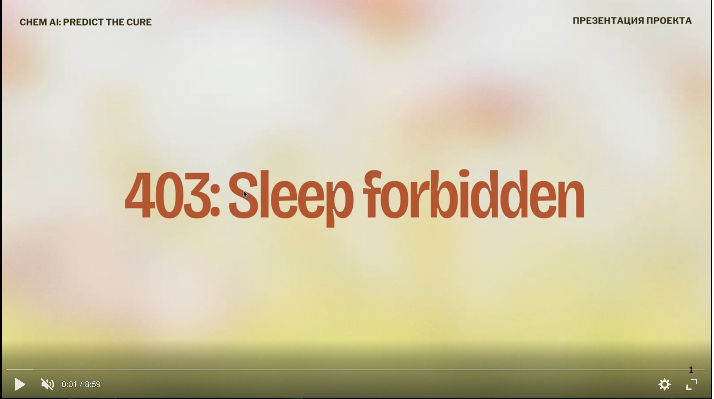
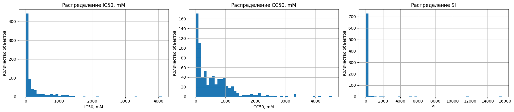

# 403: Sleep forbidden | Студенты 1-го курса магистратуры НИЯУ МИФИ - Яндекс Практикум | Группа М25-555

# ChemAI: Predict the Cure

## Содержание
- [1) Наша команда](#1-команда)
- [2) Описание задачи](#2-описание-задачи)
- [3) Краткий EDA](#3-eda--выводы-здесь-краткие-подробно---в-ноутбуке)
- [4) Инженерия признаков](#4-инженерия-признаков)
- [5) Обучение](#5-обучение-моделей)
- [6) Каггл-скор](#6-каггл-скор)

## Видеовыступление
[](https://disk.yandex.ru/d/B47JMdoQdpdQHA) 

Еще видеовыступление можно скачать [тут](https://disk.yandex.ru/d/B47JMdoQdpdQHA)

# 1. Команда

| Участник | Роль | Трек |
|----------|------|------|
| **Иван Кириян** | Тимлид | Data Science |
| **Артём Петехов** | Участник | Data Engineering |
| **Ярослава Антошина** | Участник | Data Science |
| **Антон Высоцкий** | Участник | Data Science |
| **Наталья Рогозенко** | Участник | Data Science |  

# 2. Описание задачи
[Соревнование в kaggle](https://www.kaggle.com/competitions/chem-ai-predict-the-cure/overview)

## Для каждого химического соединения необходимо предсказать три показателя:


IC50 (mM) — концентрация, при которой вещество подавляет 50% активности вируса  
CC50 (mM) — концентрация, при которой вещество токсично для 50% клеток  
SI (Selectivity Index) — индекс селективности  

В соревновании используются данные о 1000 химических соединениях, описанных с помощью числовых молекулярных дескрипторов.

## Данные разделены на:


train.csv — 750 объектов с известными значениями целевых переменных  
test.csv — 250 объектов, для которых необходимо сделать предсказания  

## Features
Каждое химическое соединение описывается 214 числовыми признаками, отражающими его физико-химические, структурные и электронные свойства.

Признаки можно условно разделить на несколько групп:
<table>
<tr>
<td width="50%">

</td>
<td width="50%">
<ol>
<li>Общие молекулярные свойства (MolWt, ExactMolWt, HeavyAtomMolWt, NumValenceElectrons, NumRadicalElectrons, MolLogP, MolMR, TPSA, LabuteASA,...)</li>
<li>Электронные и зарядовые характеристики (MaxPartialCharge, MinPartialCharge, MaxAbsPartialCharge, MinAbsPartialCharge, PEOE_VSA* — дескрипторы, связанные с распределением электронной плотности)</li>
<li>Топологические и структурные дескрипторы (Chi*, Kappa*, BalabanJ, BertzCT, HallKierAlpha, Ipc, FractionCSP3, RingCount, ...)</li>
<li>Поверхностные дескрипторы (VSA) (SMR_VSA*, SlogP_VSA*, EState_VSA*, VSA_EState*, ...)</li>
<li>Функциональные группы (fr_*) (Бинарные признаки, отражающие наличие различных химических групп: fr_alkyl_halide, fr_ester, fr_ether, fr_ketone, fr_benzene, fr_pyridine, fr_imidazole, fr_amide, fr_amine, fr_nitro, fr_halogen и многие другие)</li>
<li>Специфические дескрипторы (EState индексы (MaxEStateIndex, MinEStateIndex и др.), BCUT2D_* — спектральные дескрипторы, FpDensityMorgan* — плотности молекулярных отпечатков.</li>
</ol>
</td>
</tr>
</table>

# 3. EDA + выводы (Здесь краткие, подробно - в ноутбуке)

## 1) Провели первичный осмотр данных

- В датасете train представлены 751 строка и 214 колонок.  
- В датасете test представлены 250 строк и 211 колонок.  

Обнаружили 210 признаков в каждом наборе данных.

В качестве целевых переменных используются IC50, mM, CC50, mM и SI. Колонка index является служебным идентификатором и не используется как признак.

После исключения таргетов и index осталось 210 признаков. Наборы признаков в train и test совпали, значит одну и ту же схему обработки можно применять к обеим выборкам.

## 2) Проанализировали пропуски

В датасете train оказалось 24 пропущенных значений, в test - 12. В таргетах пропусков не оказалось. Как и бесконечных значений в обеих выборках.

```
Пропуски в train:

MaxPartialCharge        2
MinPartialCharge        2
MaxAbsPartialCharge     2
MinAbsPartialCharge     2
BCUT2D_MWHI             2
BCUT2D_MWLOW            2
BCUT2D_CHGHI            2
BCUT2D_CHGLO            2
BCUT2D_LOGPHI	        2
BCUT2D_LOGPLOW	        2
BCUT2D_MRHI	            2
BCUT2D_MRLOW	        2
```

Мы намеренно оставили пропуски незаполненными. Модель потеряла бы информацию о том, что значение отсутствует. В химических дескрипторах факт отсутствия заряда сам по себе может быть сигналом о типе молекулы. Модели извлекают этот сигнал автоматически.

## 3) Проанализировали дубликаты и типы данных

Полных дубликатов в train обнаружено не было. Все колонки имеют числовые типы данных: int64 или float64. Нечисловых признаков нет, поэтому не требуется кодирование категориальных переменных или обработка текстовых данных. Разница в количестве float64 между train и test объясняется тем, что в train дополнительно находятся три целевые переменные.

## 4) Провели анализ целевых переменных

Целевые переменные имеют разные масштабы и выраженную правостороннюю асимметрию. Особенно выделяется SI: медиана равна 4, а максимум превышает 15600. Это говорит о наличии сильных выбросов, которые могут заметно влиять на RMSE.

```
|          |   non_null |   missing_% |   mean |    std |   median |   min |      max |
|:---------|-----------:|------------:|-------:|-------:|---------:|------:|---------:|
| CC50, mM |        751 |           0 | 577.43 | 641.52 |   376.58 |  0.7  |  4538.98 |
| IC50, mM |        751 |           0 | 204.54 | 370.37 |    44.07 |  0    |  4095.19 |
| SI       |        751 |           0 |  89.15 | 788.88 |     4    |  0.01 | 15620.6  |

```


 
Гистограммы подтверждают правостороннюю скошенность таргетов. Основная часть значений находится в малом диапазоне, но есть редкие большие значения. Для SI эффект наиболее выражен: из-за экстремальных значений основная масса наблюдений визуально сжата у левого края графика.

## 5) Провели корреляционный анализ признаков

```
                    IC50, mM        CC50, mM        SI
MaxAbsEStateIndex	0.106600        -0.109807       0.007973
MaxEStateIndex	    0.106600        -0.109807   	0.007973
MinAbsEStateIndex  -0.100622	     0.091942	   -0.062446
MinEStateIndex	   -0.179369	     0.058514	    0.025656
qed	                0.106424	     0.118275	    0.044350
```

В строках находятся только признаки, а в столбцах — таргеты CC50, mM, CC50, mM и SI, поэтому тривиальные корреляции таргетов самих с собой в анализ не попадают.

Максимальная абсолютная корреляция признака с IC50, mM составляет около 0.245, с CC50, mM — около 0.307, с SI — около 0.188. Это означает, что отдельные признаки имеют только слабую или умеренную линейную связь с таргетами. Поэтому отбор признаков только по корреляции не должен быть основным методом.

## 6) Проверили константные и признаки с высокой корреляцией

В train обнаружено 18 константных признаков. Эти признаки имеют только одно уникальное значение и не несут полезной информации для модели.

Была найдена 91 пара признаков с корреляцией выше 0.95. Это говорит о наличии избыточности в данных: часть молекулярных дескрипторов описывает близкие свойства соединений.

Среди сильно коррелирующих признаков есть пары, связанные с молекулярной массой (MolWt, ExactMolWt, HeavyAtomMolWt), размером молекулы (HeavyAtomCount, Chi0, Chi1, LabuteASA) и функциональными группами (fr_COO, fr_COO2). Это ожидаемо для химических дескрипторов, так как разные признаки могут описывать похожие структурные свойства.

## 7) Изучили выбросы в признаках

У части признаков наблюдаются длинные правые хвосты. Самый заметный пример — Ipc: его 99-й процентиль значительно выше медианы. Также выраженные хвосты есть у ряда VSA/EState-дескрипторов.

# 4. Инженерия признаков

Отбор признаков проходил в несколько этапов. Каждый из участников проверял различные гипотезы, какие взять признаки для моделей.

1) На этой стадии написали модель Градиентного Бустинга. По необработанным данным train модель помогала нам искать признаки, которые лучше всего взаимодействуют с друг с другом в ходе обучения. Однако, мы решили исключить этот вариант, поскольку подробный EDA раскрыл больше информации. Модель обучалась порядка 8-ми минут, это невыгодно и дорогостояще по ресурсам в реальности.

2) После этапа EDA было принято решение не использовать feature engineering. Дополнительное ручное создание признаков могло привести не столько к улучшению качества, сколько к переобучению модели, особенно с учётом небольшого размера обучающей выборки.

Вместо генерации новых признаков основной упор был сделан на очистку и отбор уже имеющихся. Сначала из обучающей выборки были удалены экстремальные значения по целевой переменной SI. После этого из набора признаков были исключены константные столбцы, не несущие полезной информации для модели. Таких признаков оказалось 18, например NumRadicalElectrons, SMR_VSA8, SlogP_VSA9, fr_SH, fr_azide, fr_lactam и другие. После удаления константных признаков количество признаков сократилось с 210 до 192.

3) Следующим этапом был проведён анализ мультиколлинеарности. Для этого была построена матрица абсолютных корреляций между признаками, после чего удалялись признаки, имеющие корреляцию выше 0.95 с другими признаками. Такой подход позволил избавиться от дублирующих дескрипторов, которые описывали близкие свойства молекул. После корреляционного отбора количество признаков сократилось до 159.

При этом данный способ отбора был выбран как простой и устойчивый базовый вариант, но он имеет ограничение: корреляционный фильтр не учитывает важность признака относительно конкретной целевой переменной. Например, для CC50 признаки MolMR, LabuteASA, Kappa1, Kappa2 и HeavyAtomCount могут быть информативными, однако часть из них удаляется из-за высокой взаимной корреляции. 

Такой отбор позволил уменьшить размерность данных, снизить риск переобучения, ускорить обучение моделей и убрать признаки, дублирующие друг друга. 

# 5. Обучение моделей

## Пайплайн разделен на два уровня обучения:

### Уровень 1 (Базовые модели):  
Мы обучаем три разных алгоритма градиентного бустинга (**CatBoost, LightGBM, XGBoost**).

Во время K-Fold кросс-валидации каждая модель делает предсказания для той части данных, которую она не видела при обучении (Out-Of-Fold или OOF предсказания).

### Уровень 2 (Мета-модель): 
Мы берем эти OOF-предсказания от трех бустингов и используем их как новые признаки (колонки) для простой линейной модели — Ridge (Гребневая регрессия).

Ridge-регрессия смотрит на ответы базовых моделей и учится понимать, кому из них доверять больше в конкретных ситуациях, автоматически подбирая идеальные веса блендинга.

Если LightGBM нашел ложную закономерность и сильно ошибся на молекуле, но CatBoost и XGBoost дали адекватный ответ, Ridge-регрессия сгладит этот выброс.

Использование L2-регуляризации в Ridge (параметр alpha=1.0) не дает мета-модели слишком сильно привязаться к какому-то одному бустингу.

Мы отказались от медианного заполнения. Древесные алгоритмы сами строят сплиты по факту отсутствия данных (NaN), извлекая из этого полезный сигнал.

## Минусы
Обучить такой пайплайн стоит дорого по времени. Мы гоняем 3 тяжелых алгоритма по 10 фолдам на 3 разных сидах. Для 750 строк это терпимо, но на миллионах строк скрипт работал бы сутками.

В реальной ситуации поддерживать трехслойный ансамбль из разных библиотек очень тяжело.

Мы используем жесткий фильтр коллинеарности Пирсона (удаляем корреляцию > 0.95). Это может случайно выбросить дескриптор, который имеет важную нелинейную связь с токсичностью или эффективностью молекулы.

1. Утечка при отборе признаков (Global Feature Selection Leak)В обоих скриптах удаление констант (std == 0) и фильтрация коллинеарности (corr > 0.95) происходят до разбиения на фолды (K-Fold).Проблема: Матрица корреляций вычисляется с учетом данных, которые позже станут валидационным фолдом. Деревья косвенно "подглядывают" в распределение тестовой части фолда.

2. Оптимистичное смещение OOF (Early Stopping Leak)Оба скрипта используют early_stopping_rounds=100 на eval_set=(X_va, y_va), а затем генерируют OOF-предсказания на этом же X_va.Проблема: Валидационный фолд используется для остановки обучения (выбора гиперпараметра количества деревьев). Сразу после этого модель делает предсказание для этого же фолда. Прогнозы получаются чуть более точными, чем они будут на абсолютно независимом тесте.

3. Математическое смещение при логарифмировании (Неравенство Йенсена)
Когда применяется np.log1p(y), модель минимизирует ошибку в логарифмическом пространстве.Проблема: При обратном преобразовании np.expm1(y_pred) возникает математическое смещение из-за Неравенства Йенсена: $E[e^X] \ge e^{E[X]}$. Проще говоря, усредненные предсказания после экспоненты всегда будут систематически занижены относительно реального среднего таргета.Решение: В задачах на RMSE иногда требуется небольшая корректировка (например, умножение финальных прогнозов SI на константу ~1.02), чтобы вернуть среднее значение на место.

При формировании сабмита предсказания по трём сидам усредняются (seed averaging). Применяется мягкий клиппинг по 99.9-му перцентилю трейна — срезаются физически невозможные значения.

```

Вывод обучения.

--- Seed: 42 

Обучение для: IC50 (Raw-Space)
  RMSE CatBoost: 306.9638
  RMSE LightGBM: 299.3480
  RMSE XGBoost:  304.0758
 Стекинг RMSE: 296.9550

Обучение для: CC50 (Raw-Space)
  RMSE CatBoost: 437.8655
  RMSE LightGBM: 442.1137
  RMSE XGBoost:  447.5258
 Стекинг RMSE: 434.7452

Обучение для: SI (Log-Space)
  RMSE CatBoost: 134.5401
  RMSE LightGBM: 134.0382
  RMSE XGBoost:  134.0681
 Стекинг RMSE: 133.8244

--- Seed: 2024 

Обучение для: IC50 (Raw-Space)
  RMSE CatBoost: 316.9751
  RMSE LightGBM: 309.6419
  RMSE XGBoost:  314.7976
 Стекинг RMSE: 308.1489

Обучение для: CC50 (Raw-Space)
  RMSE CatBoost: 423.5637
  RMSE LightGBM: 433.5008
  RMSE XGBoost:  442.0815
 Стекинг RMSE: 420.0849

Обучение для: SI (Log-Space)
  RMSE CatBoost: 135.1769
  RMSE LightGBM: 133.5956
  RMSE XGBoost:  134.1329
 Стекинг RMSE: 133.9746

--- Seed: 7 

Обучение для: IC50 (Raw-Space)
  RMSE CatBoost: 312.2169
  RMSE LightGBM: 305.1715
  RMSE XGBoost:  307.5550
 Стекинг RMSE: 299.2056

Обучение для: CC50 (Raw-Space)
  RMSE CatBoost: 438.7185
  RMSE LightGBM: 445.2699
  RMSE XGBoost:  453.1181
 Стекинг RMSE: 436.9708

Обучение для: SI (Log-Space)
  RMSE CatBoost: 135.7592
  RMSE LightGBM: 133.7379
  RMSE XGBoost:  135.2000
 Стекинг RMSE: 134.7216
 ```


# 6. Каггл-скор


## Источники
> Egorov A.D., Gorohov Ya.V., Kuznetsov M.M. et al.
> **Prediction of the small molecule selectivity index against influenza virus strain A/H1N1 using machine learning methods**
> *Russian Chemical Bulletin*, 2025, Vol. 74, No. 3, P. 851–864.
> 🔗 [ResearchGate](https://www.researchgate.net/publication/391238960)

> A. Golbraikh, A. Tropsha
>**Predictive QSAR modeling based on diversity sampling of experimental datasets for the training and test set selection**
> *J Comput Aided Mol Des, 16 (5/6) (2002), pp. 357-369*
> 🔗[Link](https://www.researchgate.net/publication/282106343_Predictive_QSAR_modeling_based_on_diversity_sampling_of_experimental_datasets_for_the_training_and_test_set_selection)

> Alexander Tropsha
> *Best Practices for QSAR Model Development, Validation, and Exploitation*
>🔗[Link](https://docs.yandex.ru/docs/view?tm=1780156024&tld=ru&lang=en&name=QSAR_best_practices.pdf&text=Predictive%20QSAR%20modeling%20based%20on%20diversity%20sampling%20of%20experimental%20datasets%20for%20the%20training%20and%20test%20set%20selection&url=https%3A%2F%2Fis.muni.cz%2Fel%2Fsci%2Fpodzim2016%2FC2136%2Fum%2Fclanky%2FQSAR_best_practices.pdf&lr=47&mime=pdf&l10n=ru&sign=cff5b8b9ff7f29f250855dd542740b65&keyno=0&nosw=1&serpParams=tm%3D1780156024%26tld%3Dru%26lang%3Den%26name%3DQSAR_best_practices.pdf%26text%3DPredictive%2BQSAR%2Bmodeling%2Bbased%2Bon%2Bdiversity%2Bsampling%2Bof%2Bexperimental%2Bdatasets%2Bfor%2Bthe%2Btraining%2Band%2Btest%2Bset%2Bselection%26url%3Dhttps%253A%2F%2Fis.muni.cz%2Fel%2Fsci%2Fpodzim2016%2FC2136%2Fum%2Fclanky%2FQSAR_best_practices.pdf%26lr%3D47%26mime%3Dpdf%26l10n%3Dru%26sign%3Dcff5b8b9ff7f29f250855dd542740b65%26keyno%3D0%26nosw%3D1)


> R. Todeschini, V. Consonni
> **Handbook of molecular descriptors**
> *John Wiley & Sons (2008)*
> 🔗[Link](https://books.google.it/books?hl=ru&lr=&id=TCuHqbvgMbEC&oi=fnd&pg=PP2&ots=jxGxyawJrf&sig=78AarXaOVHcaQPISJNZu4Kb_fWA&redir_esc=y#v=onepage&q&f=false)


